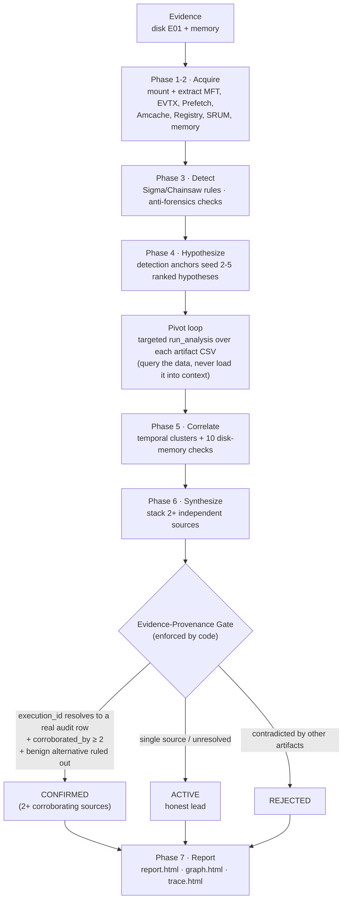

# SAVVYDFIR-MCP

> DFIR MCP server for SIFT Workstation that correlates disk and memory evidence, tracks provenance, and produces investigation reports.

[](LICENSE)
[](https://github.com/teamdfir/protocol-sift)
[](https://www.anthropic.com/claude-code)

---

> **📌 Judged submission = tag [`v1.1.1`](https://github.com/kismatkunwar89/SAVVYDFIR-MCP/releases/tag/v1.1.1) (commit `f1770df`).**
> To reproduce the hackathon evaluation exactly, check out that tag:
> ```bash
> git clone https://github.com/kismatkunwar89/SAVVYDFIR-MCP.git
> cd SAVVYDFIR-MCP && git checkout v1.1.1
> ```
> Commits on `master` after `v1.1.1` are post-submission **maintenance** — multi-host graph-pipeline
> fixes. Default behavior is unchanged for existing callers, with one intentional change: cross-host
> **account correlation now requires prefixed `account:` indicators** (raw description text is no longer
> scraped, which previously produced false edges). Not part of the judged submission.

---

## FIND-EVIL Hackathon Submission Checklist

Every required turn-in is listed below with its exact location, so judges can verify completeness at a glance. All paths are relative to the repository root.

| # | Required component | Where to find it | Status |
|---|---|---|:---:|
| 1 | Public code repository | <https://github.com/kismatkunwar89/SAVVYDFIR-MCP> | DONE |
| 2 | Open-source license (MIT) | [`LICENSE`](LICENSE) | DONE |
| 3 | README with setup instructions | This file, [Installation](#installation) | DONE |
| 4 | Step-by-step run instructions | This file, [Usage](#usage) | DONE |
| 5 | Text description of features | This file, [What It Does](#what-it-does) + [Architecture](#architecture) | DONE |
| 6 | Demonstration video | **[ADD VIDEO URL BEFORE SUBMIT]** (see note below) | TODO |
| 7 | Architecture diagram | This file, [Architecture](#architecture), plus [`docs/architecture.md`](docs/architecture.md) | DONE |
| 8 | Evidence dataset documentation | [`docs/dataset-documentation.md`](docs/dataset-documentation.md) | DONE |
| 9 | Accuracy report | [`docs/accuracy-report.md`](docs/accuracy-report.md) | DONE |
| 10 | Agent execution logs | [`docs/agent-execution-logs/`](docs/agent-execution-logs/) — rendered `report.html` + `graph.html` for all 5 cases; hash-chained `audit.jsonl` for 4/5 (ROCBA predates audit retention, disclosed) | DONE |

> **ACTION REQUIRED before submitting:** replace the requirement #6 placeholder above with the live demonstration video URL. This is the only component that cannot be completed from the repository alone.

---

## What It Does

SAVVYDFIR-MCP is a purpose-built MCP (Model Context Protocol) server that turns Claude Code into a DFIR investigation interface on SANS SIFT Workstation. It exposes **60+** typed forensic tools over stdio transport (61 at this writing — call `describe_tool_catalog` for the live count, don't hardcode it), supports cross-artifact correlation between disk and memory evidence via 10 anti-forensics detection checks, and keeps findings traceable through persisted artifacts, state, and a hash-chained audit log, with structured provenance (every CONFIRMED finding cites a resolvable `execution_id`; heuristics carry CTX-NNN references).

**Design: autonomous-first.** You point it at a case `manifest.json` and it
investigates with minimal interaction — the 7-phase workflow is enforced by **hooks
and a coverage gate in code**, not by a human driving each step. The
`CONFIRMED / ACTIVE / REJECTED` states are the agent's own evidence-graded output
lifecycle (a human reviews the final `report.html` + hash-chained audit trail); this
is **not** a manual, click-through investigator console. An interactive,
analyst-driven review surface (e.g. an Approve/Reject canvas like the one in the
decision flow below) is on the roadmap, not current scope.

---

## Architecture

```
  Evidence Files                     SIFT CLI Tools              MCP Server
  ─────────────                     ──────────────              ──────────
  /evidence/disk/*.E01    ───>    ewfmount, fls, mmls     ───>  ┌──────────────┐
  /evidence/memory/*.zip  ───>    vol3, yara              ───>  │ savvydfir-mcp│
                                  MFTECmd, EvtxECmd       ───>  │ (FastMCP)    │
                                  log2timeline.py         ───>  │              │
                                  regripper, strings      ───>  │  SafeRunner  │
                                                                │  AuditLogger │
                                                                │  StateManager│
                                                                └──────┬───────┘
                                                                       │ stdio
                                                                       │ JSON-RPC
                                                                       v
                                                                ┌──────────────┐
                                                                │  Claude Code │
                                                                │  Agent Loop  │
                                                                │              │
                                                                │  Skill:      │
                                                                │ .agents/     │
                                                                │ skills/      │
                                                                │ workflow     │
                                                                └──────┬───────┘
                                                                       │
                                                                       v
                                                                ┌──────────────┐
                                                                │   Output     │
                                                                │              │
                                                                │ state.json   │
                                                                │ audit.jsonl  │
                                                                │ report.html  │
                                                                │ graph.html   │
                                                                └──────────────┘
```

### Investigation & Decision Flow

The agent does not free-associate over evidence — it runs a **documented** 7-phase
workflow (the sequence below is the intended order; the agent may reorder steps within a
case) where **detection anchors seed hypotheses**, hypotheses drive **targeted
queries**, and every conclusion must **earn** its confidence by stacking
independent sources through an evidence-provenance gate. Negative space (a missing
artifact) is treated as evidence, not silence.



**How a verdict is decided (the finding lifecycle).** Every finding starts as an
`OBSERVATION` / `INFERENCE` / `HYPOTHESIS` and is **promoted to `CONFIRMED` only
when it clears three code-enforced invariants** — not by the model's say-so:

1. **Provenance** — its `execution_id` must resolve to a real `audit.jsonl` row
   (no inherited claims, no placeholder IDs).
2. **Corroboration** — ≥ 2 independent artifact sources agree (1 source = `ACTIVE`
   lead, never confirmed; "stacking defeats anti-forensics").
3. **Alternative ruled out** — the strongest benign explanation is recorded with a
   specific observation that refutes it; unresolved alternatives force a downgrade.

These are the agent's **autonomously-assigned, evidence-graded** output states
(`CONFIRMED` / `ACTIVE` / `REJECTED`) — defensible, reviewable conclusions in the
final report, not raw detector noise. A human reviews the finished report + audit
trail; the agent is not driven click-by-click. The coverage gate blocks **strict**
report generation until configured coverage requirements are satisfied (e.g.
`generate_graph` completion and conditional anti-forensics follow-up such as `analyze_vss`
when signals are present); a caller can pass `allow_partial=true` to bypass blocking
coverage checks (in the Ali run the report was then marked `COMPLETE_WITH_GAPS`).
disk↔memory contradictions emit **self-correction events** to the audit log. Full layer
breakdown + interfaces: [`docs/architecture.md`](docs/architecture.md).

---

## Prerequisites

| Requirement | Detail |
|---|---|
| **OS** | Ubuntu 22.04+ x86-64. **Primary tested:** SANS SIFT Workstation 2024 (Ubuntu 24.04 LTS). Ubuntu 22.04 works but is not the primary test target. |
| **CPU + RAM** | 4 vCPU, **8 GB RAM minimum** (16 GB recommended). The framework's Phase 2 disk extraction can spike to ~6 GB; 4 GB swap is required if you stay at 8 GB RAM. |
| **Disk** | 80 GB free minimum (evidence + Plaso super-timeline + Vol3 symbol cache + audit logs) |
| **Shell** | bash, sudo, git, curl, `python3` (3.10+) - `install.sh` installs everything else automatically |
| **Internet (install time)** | needed for `pipx install volatility3`, the Chainsaw release binary, and the Sigma rules clone. Investigations themselves do **not** require internet beyond Anthropic Claude API access. |

**Note on SIFT 2024:** A clean SIFT Workstation 2024 install ships with EZ Tools, Sleuth Kit (`fls`/`mmls`/`icat`), Plaso, ewfmount, esedbexport, dotnet, and Python 3.12. It does **not** ship with Volatility 3, Chainsaw, or the Sigma rules corpus - `install.sh` installs all three.

---

## Installation

One-line install (recommended):

```bash
git clone https://github.com/kismatkunwar89/SAVVYDFIR-MCP.git
cd SAVVYDFIR-MCP
bash install.sh
```

`install.sh` is idempotent - safe to re-run. It will:

1. **Verify** Python 3.10+, pip, git are present.
2. **Install** apt prerequisites: `python3-venv`, `tmux`, `libfuse2t64` (or `libfuse2`), `libewf-dev`, `build-essential`, `pipx`, `curl`, `jq`.
3. **Install Volatility 3** via `pipx install volatility3` (creates `vol` on PATH).
4. **Install Chainsaw** - downloads the latest pre-built binary from GitHub releases to `/usr/local/bin/chainsaw`.
5. **Clone Sigma rules** to `/opt/sigma` (the corpus Chainsaw runs against).
6. **Install Claude Code** via the native installer (`curl -fsSL https://claude.ai/install.sh | bash`) if not already present.
7. **Ensure `~/.local/bin` is on PATH** (writes to `~/.bashrc` once).
8. **Optional: install Protocol SIFT** - skip with `SKIP_PROTOCOL_SIFT=1 bash install.sh` if you don't need the SANS framework.
9. **Create venv** at `./venv/` and install `requirements.txt`.
10. **Deploy Claude Code global config** (`CLAUDE.md` + skills) to `~/.claude/`.
    Hooks, permissions, and MCP server registration live in the **project-local** `.claude/settings.json`
    inside the repo - they take effect automatically when you launch `claude` from the repo directory.
    `install.sh` does **not** write a `~/.claude/settings.json`, so it cannot drift out of sync with the
    Claude Code schema your installed version expects.
11. **Create directories**: `/cases/{analysis,exports,reports}` and `/evidence/{disk,memory}` (with sudo) or `~/cases` + `~/evidence` fallback.
12. **Verify** the Python environment by importing fastmcp + pydantic.

After install completes:

```bash
# 1. Pick up new PATH (claude + vol + chainsaw + pipx-installed bins)
source ~/.bashrc

# 2. Authenticate Claude Code (browser flow - one-time)
#    IMPORTANT: stay INSIDE the SAVVYDFIR-MCP directory so the project-local
#    .claude/settings.json (hooks + MCP server + permissions) gets picked up.
cd SAVVYDFIR-MCP   # if you aren't already here
claude

# 3. Activate venv for direct Python use (optional - MCP starts it automatically via .mcp.json)
source venv/bin/activate

# 4. Verify the framework imports
python -c "import sift_mcp.server; print('OK')"
```

> **Why no `~/.claude/settings.json`?** Earlier versions of this installer deployed a global
> settings file that could fall out of sync with the Claude Code schema (e.g. `claude login` would
> error on `hooks.PostToolUse[0].hooks: Expected array, but received undefined`). The project-local
> `.claude/settings.json` at the repo root is now the single source of truth and is committed to
> git alongside the code that depends on it - schema and hooks stay in lockstep.

For a production deployment to `/opt/SAVVYDFIR-MCP/` (so any user on the box can run investigations), copy after the local install verifies:

```bash
sudo cp -r . /opt/SAVVYDFIR-MCP/
sudo chown -R $USER:$USER /opt/SAVVYDFIR-MCP/
```

Notes:

- Anthropic now recommends the native Claude Code installer on macOS, Linux, and WSL. It auto-updates in the background.
- `npm install -g @anthropic-ai/claude-code` still exists, but Anthropic documents it as deprecated in favor of the native installer.
- For interactive use, run `claude` and complete the browser login. `ANTHROPIC_API_KEY` is useful for API-key automation but is no longer the best default for humans.

---

## Usage

> **Working directory:** the examples below use `/opt/SAVVYDFIR-MCP` (the optional
> production deploy from Installation step 11). If you only ran `bash install.sh`
> in your clone, use your clone directory instead (e.g. `cd ~/SAVVYDFIR-MCP`).
> Always launch `claude` from inside the repo so the project-local
> `.claude/settings.json` (hooks + MCP server) is picked up.

### Execution model

Investigations run **autonomously**. When you launch `claude` from the repo root, the project-local
`.claude/settings.json` **hooks load automatically** and enforce the workflow — a PreToolUse gate
(`.claude/hooks/workflow-enforce-pre.py`) and a PostToolUse gate (`workflow-enforce-post.py`) that block
`generate_report` until the mandatory detectors have run. These hooks are **always-on enforcement, not a
toggle**: launching from *outside* the repo means `settings.json` isn't picked up and the coverage gate
is silently disabled — so always `cd` into the repo first. There is **no per-tool approval/checkpoint
UI** today — you review the finished `report.html` + hash-chained audit trail; an interactive
Approve/Reject review canvas is roadmap, not current scope.

### Run a single host — two equivalent styles

Both are autonomous and hook-enforced; choose by whether you want to watch the session.

**Interactive** (analyst-initiated, watch it run live):
```bash
cd SAVVYDFIR-MCP                       # or /opt/SAVVYDFIR-MCP if deployed to production
claude --dangerously-skip-permissions --allowedTools "mcp__savvydfir__*"
# then type at the prompt:
#   Read case-templates/manifest.json and investigate fully following the 7-phase workflow.
```

**Headless one-shot** (unattended / scripted / CI):
```bash
cd SAVVYDFIR-MCP
claude --allowedTools "mcp__savvydfir__*" --dangerously-skip-permissions \
  -p "Read case-templates/manifest.json and start the investigation. Investigate fully following the 7-phase workflow, run the mandatory tools detect_injection(case_id), compare_disk_and_memory(case_id), and sigma_hunt(case_id), then call generate_report(case_id) and generate_graph(case_id), and stop only after both report outputs are written."
```

> **Permissions:** `--allowedTools "mcp__savvydfir__*"` pre-allows the forensic tools (narrows tool
> access). `--dangerously-skip-permissions` skips **all** per-tool confirmation prompts — required for
> unattended autonomous runs, but it bypasses every confirmation, so use it only inside a **trusted,
> isolated DFIR VM** (the intended deployment).

> **Note:** `sigma_hunt` (Chainsaw, 2,278 Sigma rules) is the mandatory detection
> tool the report coverage gate checks for - do not confuse it with `sigma_scan`
> (a separate anomaly-detector tool). Naming `sigma_hunt` explicitly avoids the
> report blocking on a missing-coverage gate.

Claude calls MCP tools → accumulates findings → writes `analysis/state.json` + `analysis/audit.jsonl` → calls `generate_report(case_id)` and `generate_graph(case_id)`.
Output: `reports/{case_id}/report.html` and `reports/{case_id}/graph.html`.

### Multi-host Enterprise Investigation

Run each host as a separate Claude session with its own analysis directory:

```bash
# Per host - set SAVVYDFIR_ANALYSIS_DIR to isolate state
SAVVYDFIR_ANALYSIS_DIR=/opt/SAVVYDFIR-MCP/investigations/<host-case-id> \
  claude --allowedTools "mcp__savvydfir__*" \
  -p "Read case-templates/manifest.json and investigate."

# After all hosts - merge into unified cross-host graph
claude --allowedTools "mcp__savvydfir__*" \
  -p "Call merge_host_graphs() then build_reports_index()."
```

Serve all reports:

```bash
cd /opt/SAVVYDFIR-MCP/reports && python3 -m http.server 8080
# Open: http://<server>:8080/index.html
```

### Optional: agent-session trace alongside the report

`report.html` carries the forensic narrative. The framework also lets you
render the Claude Code agent's step-by-step session as a `trace.html`
companion using the open-source `claude-code-log` tool (pinned to v1.3.0 in
`requirements.txt`). The helper script applies a layered redaction pass -
operator filesystem paths, API/credential shapes, session UUIDs, operator-LAN
IPs - and writes the result into the same `reports/<case_id>/` directory
served by the static HTTP server above. The link automatically appears in
`report.html` once the trace file exists.

**Always pass `--session-jsonl` explicitly** (safer than auto-discovery, which
picks the most-recent JSONL by mtime). **`--detail high` is opt-in for internal
audit prep only** - the default `--detail low` is the safer disclosure level
for any public submission. **Mandatory eyeball pass** in a browser before
publishing: redaction is best-effort.

```bash
# One-time: install the optional dependency
./venv/bin/pip install claude-code-log==1.3.0

# Render (default detail=low)
./venv/bin/python3 scripts/render_session_trace.py \
    --case-id MY-CASE-001 \
    --session-jsonl ~/.claude/projects/<hash>/<session-id>.jsonl

# Then re-run generate_report to surface the "View Agent Session Trace" link
# in report.html. The link is rendered only when trace.html actually exists.
```

### Investigation graph (graph.html)

`generate_graph(case_id)` produces an interactive D3 graph at
`reports/<case_id>/graph.html` (plus `graph.json`). The sidebar groups findings
into an **Artifact Type** tree (Memory / Event Logs / Filesystem / Execution
Artifacts / Registry / Network-SRUM), an **Analysis Layers** section (Rule
Detection - Sigma/Hayabusa/YARA, Correlation), and **Node Roles** toggles, with
an Evidence Kind legend. Click any bucket to filter; the `View:` chip + `Visible:
X / Y` status + `↺ Show all` reset track what's shown. The `Case → Evidence
Source → Finding` lineage (the `produced` arrows) is visible by default.

Classification is data-driven and **case-agnostic**: findings bucket from their
`artifact_type` + `artifact_subtype`; when `artifact_subtype` is blank (legacy
findings), a `tool_name` fallback recovers it. Unknown artifact families degrade
to `Uncategorized` - the sidebar never breaks.

Both `graph.html` and `graph.json` are judge-facing artifacts, so
`investigation_graph.py` runs a **recursive infrastructure-path redaction pass**
before writing either: operator install paths (`/opt/SAVVYDFIR-MCP/`,
`/home/<operator>/`), and the `/cases/`, `/evidence/`, `/mnt/` RBAC prefixes are
replaced with `<install>/`, `<home>/`, `<case-dir>/`, `<evidence>/`, `<mount>/`.
Forensic evidence (case emails, attacker IPs, registry paths, hostnames, finding
IDs) is preserved. No flags needed - it runs automatically on every
`generate_graph`. Design notes + the maintenance contract (how to add a new
artifact family) are documented inline in the graph renderer module;
the bucket/redaction regression fixture is `tests/fixtures/graph_bucket_synthetic/`.

---

## Validation Status

Validated **blind** end-to-end on five independent blind cases — **0 hallucinations across all** (full results in [`docs/accuracy-report.md`](docs/accuracy-report.md); per-case artifacts in [`docs/agent-execution-logs/`](docs/agent-execution-logs/)):

- **ROCBA-2020-FREDS-LAPTOP** — insider IP theft (Windows) — 90% recall, 107 findings, 3 CONFIRMED.
- **LONEWOLF-2018-DESKTOP-PM6C56D** — mass-shooting plot (Windows) — 91.7% recall, 88 findings, 2 CONFIRMED.
- **NIST-DATALEAK-2015-PC** — insider data leak (Windows, disk-only) — 60% recall, 503 findings, 4 CONFIRMED.
- **ALI-WEBSERVER-WIN-L0ZZQ76PMUF** — web-server breach (Win Server 2008) — 92.3% recall, 427 findings, 2 CONFIRMED.
- **NIST-HACKINGCASE-2004-MREVIL** — war-driving / credential theft (Win XP) — 86.7% recall, 304 findings, 3 CONFIRMED.

Each case is a different attack class and OS era (2004–2020); the framework adapted with no cross-case contamination.

Framework operational properties:

- Audit-backed completion for `sigma_hunt`, `compare_disk_and_memory`, `find_temporal_clusters`, `generate_report`
- Summary-first MCP responses for heavy disk tools (csv_path + run_analysis mediation)
- PreToolUse phase-transition gate **blocks** `sigma_hunt`, `hayabusa_hunt`, and `compare_disk_and_memory` until the eight required Phase 2 disk tools have succeeded or recorded an explicit absence (override: `SAVVYDFIR_SKIP_PHASE3_GATE=1`; state-read errors fail open). Other detection tools (e.g. `detect_injection`) are not covered by this gate, so observed step ordering can still vary
- Memory-hygiene mitigations (stdout/stderr drop post-audit, gc.collect after heavy tools) - validated under 7.6 GB RAM constraint with 4 GB swap
- Per-tool Vol3 timeout (malfind: 900 s, overrideable via `SAVVYDFIR_MALFIND_TIMEOUT`)
- Vol3 `incompatible_profile` classification → `tool_incompatible` outputs_summary marker; coverage gate treats this as a legitimate gap (no zombie retries when the image's kernel build has no matching symbols)
- `EvidenceFinding.timestamp_observed` populated by detectors with artifact event-time in scope (MFT timestomping $SI_created, Sigma hit `system_time`); `find_temporal_clusters` prefers event-time over finding creation-time
- IOC categorizer aligned with STIX 2.1 / MISP attribute types (IP, hostname, URL, hash, file path/name, account, email, registry) - drops tooling internals
- `COMPLETE_WITH_GAPS` remains an expected investigation outcome when unresolved forensic discrepancies are documented (anti-forensics-induced gaps); it is not treated as a report-generation failure

Still pending broader end-to-end validation:

- Multi-host merge flow: `merge_host_graphs()` and `build_reports_index()`
- MCP-hosted graph serving via `serve_graph()` as the primary operator path
- Deferred optimization work from the original plan: parallel RECmd execution and wider timeout tuning
- Full live coverage of less-used artifact tools such as `analyze_vss`, `extract_pca`, `extract_shimcache`, `extract_srum`, `coverage_report`, and YARA/timeline workflows

So the current repo is ready for single-host investigations and Batch 1-4 validation, with adjacent multi-host and less-used artifact workflows still marked as pending live validation rather than fully signed off.

---

## Skills Reference

Claude Code skills provide on-demand forensic expertise. Skills auto-discover at startup (only name + description load). Full content loads when invoked.

| Slash Command | Skill | What It Does |
|---|---|---|
| `/memory-forensics` | Memory Forensics | Volatility 3 plugins: pslist, psscan, netscan, malfind, dlllist, hashdump |
| `/disk-forensics` | Disk Forensics | ewfmount, mmls, fls, icat - E01 mounting and filesystem analysis |
| `/ez-tools` | EZ Tools | MFTECmd, EvtxECmd, PECmd, AppCompatCacheParser, LECmd, JLECmd, SBECmd, regripper |
| `/timeline` | Timeline | log2timeline.py + psort.py - super timeline creation and filtering |
| `/yara` | YARA | Signature scanning on disk files and memory dumps |

---

## Evidence Structure

```
/evidence/
  disk/
    <host>.E01                     # Disk image (E01 or raw dd)
  memory/
    <host>-memory.zip              # Memory dump (optional - disk-only is supported)
```

Evidence directories are READ-ONLY. By default output goes to `analysis/` and `reports/`. Set `SAVVYDFIR_ANALYSIS_DIR` before launching Claude when you want per-host isolation.

---

## Manifest Fields

```json
{
  "case_id": "CASE-001",
  "mode": "blind",
  "investigation_goal": "Identify initial access, persistence, and lateral movement.",
  "disk_images": [
    {"path": "/evidence/disk/image.E01", "host": "wkstn-01", "image_type": "E01"}
  ],
  "memory_dumps": [
    {"path": "/evidence/memory/dump.zip", "host": "wkstn-01"}
  ],
  "known_iocs": [],
  "max_iterations": 4
}
```

| Field | Description |
|---|---|
| `case_id` | Unique case identifier |
| `mode` | `"blind"` (no IOC hints) or `"seeded"` (IOCs provided to agent) |
| `investigation_goal` | What the agent should determine |
| `disk_images` | Array of disk images with path, host, and format |
| `memory_dumps` | Array of memory dumps with path and host |
| `known_iocs` | IOC array (empty for blind mode) |
| `max_iterations` | Maximum triage iterations before forced completion |

---

## MCP Tools (60+)

| Namespace | Tools | Description |
|---|---|---|
| evidence | `verify_integrity`, `get_provenance` | Hash verification and finding traceability |
| disk | `extract_prefetch`, `get_amcache`, `extract_mft_timeline`, `list_deleted_files`, `summarize_evtx`, `extract_registry_run_keys` | Windows disk artifact analysis |
| memory | `detect_profile`, `list_processes`, `scan_processes`, `scan_network`, `detect_injection`, `list_dlls` | Volatility 3 memory analysis |
| timeline | `build_timeline`, `query_timeline` | Plaso super timeline — **optional**, not gate-enforced, not used in the validated single-host flow |
| yara | `scan_files`, `scan_memory` | YARA signature scanning |
| correlation | `compare_disk_and_memory`, `flag_discrepancy`, `find_temporal_clusters` | Cross-artifact correlation (10 anti-forensics checks) + temporal clustering for synthesis |
| state | `read_state`, `get_finding`, `get_findings`, `export_trace`, `describe_tool_catalog` | Case state summary, retrieval, trace export, and catalog metadata |
| lifecycle | `start_investigation`, `add_finding`, `coverage_report`, `generate_report` | Investigation lifecycle |
| mounting | `mount_image`, `load_memory` | Evidence preparation |
| graph | `generate_graph`, `serve_graph`, `merge_host_graphs`, `build_reports_index` | D3 investigation graph + multi-host unified view + reports dashboard |
| detection | `sigma_hunt`, `query_sigma_results`, `sigma_scan`, `analyze_vss`, `extract_pca`, `extract_shimcache`, `extract_srum` | Sigma/Chainsaw detection, read-only Sigma result paging, VSS recovery, PCA, ShimCache, SRUM |
| analysis | `run_analysis` | Targeted local Pandas analysis over CSV outputs |

### Retrieval and Response Contracts

- `read_state(case_id)` is the summary/resume surface. Use it for case status, counts, open questions, and the latest finding window.
- `get_findings(case_id, ...)` is the full finding-corpus retrieval surface. It supports `artifact_type`, `evidence_kind`, `finding_status`, `mitre_tactic`, `min_confidence`, `limit`, and `offset`.
- `get_finding(case_id, finding_id)` drills into a single `F-NNN` record.
- `extract_prefetch`, `get_amcache`, `extract_mft_timeline`, `summarize_evtx`, `extract_registry_run_keys`, and `generate_report` are summary-first by default. Pass `response_format="detailed"` only when you truly need raw `data` arrays.
- `extract_prefetch` separates exact Prefetch-native execution history from `.pf` file metadata: use `last_run_times` for run history, and treat `pf_created_time` / `pf_modified_time` as `.pf` file timestamps.
- `sigma_hunt(...)` creates findings and persists full hunt output. Use `query_sigma_results(output_path=..., ...)` for read-only filtering and paging over persisted Sigma JSON.
- Summary mode preserves the operational fields agents need, including `execution_id`, `records_count`, `total_records`, `csv_path`, `cache_hit`, and `findings_created`.

---

## Scoring (TP/FP/FN)

When evaluating against ground truth:

- **True Positive (TP):** Finding matches a known-bad artifact in ground truth
- **False Positive (FP):** Finding flagged as suspicious but is benign per ground truth
- **False Negative (FN):** Known-bad artifact in ground truth not detected by agent

The `compare_disk_and_memory()` correlation engine runs **10** anti-forensics checks — the 6 core checks below, plus 4 extended (USN-journal timestamp validation, ShimCache vs Amcache, EID 1102 log-clearing, SRUM exfiltration):
1. Process in memory with no disk binary (fileless)
2. Execution evidence for deleted binary (cleanup)
3. VAD anomaly on legitimate process path (injection)
4. Network connection with no disk artifact (fileless C2)
5. Registry persistence key for missing binary (cleaned malware)
6. SI vs FN timestamp mismatch (timestomping)

---

## Self-Correction

When `compare_disk_and_memory` detects an evidence contradiction, it can emit a
correction event and downgrade the affected finding's **confidence**. The intended
lifecycle is:
1. Log a `CORRECTION_EVENT` to `audit.jsonl`
2. Downgrade the affected finding
3. Run follow-up tools from the alert's `recommended_followup`
4. Re-promote or reject based on new evidence

It is evidence-triggered — it fires when disk and memory contradict, not when the LLM
second-guesses itself. **Honesty caveat from the captured traces:** steps 1–2 were
observed in **3 of 8 runs (16 correction events total)**, where step 2 was a confidence
demotion (not necessarily a status change to `HYPOTHESIS`). Automated follow-up and
re-adjudication (steps 3–4) were **not demonstrated** in those traces (`revised_finding_id`
was always null) — treat them as designed-but-unproven.

---

## Project Structure

```
SAVVYDFIR-MCP/
├── CLAUDE.md                          # Business Brain (skills routing + rules)
├── README.md                          # This file
├── .mcp.json                          # MCP server connection config
├── requirements.txt                   # Python dependencies
├── .claude/
│   ├── settings.json                  # Claude Code MCP + hook config
│   ├── hooks/
│   │   ├── session-start.py           # Session bootstrap
│   │   ├── workflow-enforce-pre.py     # PreToolUse gate (report/lane coverage)
│   │   ├── workflow-enforce-post.py    # PostToolUse gate (phase transitions)
│   │   └── stop.py                    # Completion verification from state.json + audit.jsonl
│   ├── agents/                        # Specialist analysts (MFT, EVTX, registry, memory, etc.)
│   └── skills/
│       ├── investigation-workflow/    # Primary investigation sequencing guidance
│       ├── artifact-routing/          # Artifact-to-specialist routing
│       ├── pivot-methodology/         # Cross-artifact pivoting patterns
│       ├── sigma-detection/           # Sigma detection + ATT&CK mapping
│       └── tools-reference/           # Tool contract reference
├── case-templates/
│   └── manifest.json                  # Example case manifest
├── sift_mcp/
│   ├── server.py                      # FastMCP entry point (all tools registered)
│   ├── audit.py                       # JSONL audit logger (fail-closed)
│   ├── state.py                       # Case state manager
│   ├── models/                        # Pydantic data models
│   ├── tools/                         # MCP tool implementations
│   └── runners/                       # SafeRunner subprocess wrappers
├── scripts/
│   ├── investigation_graph.py         # Per-case D3 graph builder (called by generate_graph)
│   ├── merge_graphs.py               # Cross-host IOC graph merger (called by merge_host_graphs)
│   └── build_index.py                # Reports index generator (called by build_reports_index)
├── analysis/                          # Default single-host working state
│   ├── state.json
│   └── audit.jsonl
├── investigations/                    # Optional per-host state roots via SAVVYDFIR_ANALYSIS_DIR
│   └── {SCENARIO}-{HOST}/
│       ├── manifest.json
│       ├── state.json
│       └── audit.jsonl
├── reports/                           # Investigation outputs (gitignored)
│   ├── index.html                     # Dashboard (build_reports_index)
│   ├── {case_id}/
│   │   ├── report.html                # Per-host report (generate_report)
│   │   ├── graph.html                 # Per-host graph (generate_graph)
│   │   └── graph.json
│   └── unified/
│       ├── graph.html                 # Cross-host graph (merge_host_graphs)
│       └── graph.json
└── docs/                              # Architecture and methodology docs
```

---

## Acknowledgements & Third-Party Attribution

SAVVYDFIR-MCP is an **orchestration layer** — it does not reimplement forensic
parsers; it drives best-in-class open-source DFIR tools (Sigma, Chainsaw,
Hayabusa, Eric Zimmerman's EZ Tools, Volatility 3, Plaso, The Sleuth Kit, YARA,
libyal) and adds cross-artifact correlation + an evidence-provenance gate on top.
One file is vendored verbatim — Chainsaw's official Sigma→EVTX mapping
(`rules/chainsaw-sigma-mapping.yml`, **GPL-3.0**, © WithSecure Labs).

Full credits, sources, and licenses for every third-party tool, vendored file,
Python dependency, test fixture, and evaluation dataset are in
**[`THIRD_PARTY.md`](THIRD_PARTY.md)**. ATT&CK® is a trademark of The MITRE Corporation.

## License

MIT License - Copyright (c) 2026 Kismat Kunwar. See [LICENSE](LICENSE).
The MIT license covers **this project's own code only**; vendored/invoked
third-party works retain their own licenses (see `THIRD_PARTY.md`).
