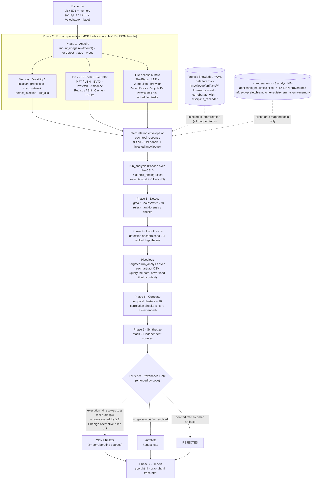

# SAVVYDFIR-MCP

> DFIR MCP server for SIFT Workstation that correlates disk and memory evidence, tracks provenance, and produces investigation reports.

[](LICENSE)
[](https://github.com/teamdfir/protocol-sift)
[](https://www.anthropic.com/claude-code)

---

> **📌 Judged submission = tag [`v1.1.1`](https://github.com/kismatkunwar89/SAVVYDFIR-MCP/releases/tag/v1.1.1). Latest release = [`v1.2.2`](https://github.com/kismatkunwar89/SAVVYDFIR-MCP/releases/tag/v1.2.2).**
> `master` tracks the latest code. `v1.1.1` is the immutable judged baseline; post-`v1.1.1` work (released as
> `v1.2.0`) is backward-compatible and adds native file-access extractors (Recycle Bin, PowerShell history,
> scheduled tasks), durable artifact reuse, case-insensitive / UTF-16 mount handling, and experimental
> triage-layout detection. To reproduce the hackathon evaluation exactly: `git checkout v1.1.1`.

---

## FIND-EVIL Hackathon Submission Checklist

Every required turn-in is listed below with its exact location, so judges can verify completeness at a glance. All paths are relative to the repository root.

| # | Required component | Where to find it | Status |
|---|---|---|:---:|
| 1 | Public code repository | <https://github.com/kismatkunwar89/SAVVYDFIR-MCP> | DONE |
| 2 | Open-source license (MIT) | [`LICENSE`](LICENSE) | DONE |
| 3 | README with setup instructions | This file, [Installation](#installation) | DONE |
| 4 | Step-by-step run instructions | This file, [Usage](#usage) | DONE |
| 5 | Text description of features | This file, [What It Does](#what-it-does) + [Architecture](#architecture) | DONE |
| 6 | Demonstration video | <https://youtu.be/2tDT23DmE1I> | DONE |
| 7 | Architecture diagram | This file, [Architecture](#architecture), plus [`docs/architecture.md`](docs/architecture.md) | DONE |
| 8 | Evidence dataset documentation | [`docs/dataset-documentation.md`](docs/dataset-documentation.md) | DONE |
| 9 | Accuracy report | [`docs/accuracy-report.md`](docs/accuracy-report.md) | DONE |
| 10 | Agent execution logs | [`docs/agent-execution-logs/`](docs/agent-execution-logs/) - rendered `report.html` + `graph.html` for all 5 cases; hash-chained `audit.jsonl` for 4/5 (ROCBA predates audit retention, disclosed) | DONE |

> **Demonstration video:** <https://youtu.be/2tDT23DmE1I> - a live start on the ROCBA case plus a walkthrough of a completed run, the deliverables (report.html / report.pdf / graph.html), and a self-correction event.

---

## What It Does

SAVVYDFIR-MCP is a purpose-built MCP (Model Context Protocol) server that turns Claude Code into a DFIR investigation interface on SANS SIFT Workstation. It exposes **60+** typed forensic tools over stdio transport (65 at this writing - call `describe_tool_catalog` for the live count, don't hardcode it), supports cross-artifact correlation between disk and memory evidence via 10 anti-forensics detection checks, and keeps findings traceable through persisted artifacts, state, and a hash-chained audit log, with structured provenance (every CONFIRMED finding cites a resolvable `execution_id`; heuristics carry CTX-NNN references).

**Design: autonomous-first.** You point it at a case `manifest.json` and it
investigates with minimal interaction - the 7-phase workflow is enforced by **hooks
and a coverage gate in code**, not by a human driving each step. The
`CONFIRMED / ACTIVE / REJECTED` states are the agent's own evidence-graded output
lifecycle (a human reviews the final `report.html` + hash-chained audit trail); this
is **not** a manual, click-through investigator console. An interactive,
analyst-driven review surface (e.g. an Approve/Reject canvas like the one in the
decision flow below) is on the roadmap, not current scope.

---

## Architecture

```
  Evidence Files                     SIFT CLI Tools              MCP Server
  ─────────────                     ──────────────              ──────────
  /evidence/disk/*.E01    ───>    ewfmount, fls, mmls     ───>  ┌──────────────┐
  /evidence/memory/*.zip  ───>    vol3, yara              ───>  │ savvydfir-mcp│
                                  MFTECmd, EvtxECmd       ───>  │ (FastMCP)    │
                                  log2timeline.py         ───>  │              │
                                  regripper, strings      ───>  │  SafeRunner  │
                                                                │  AuditLogger │
                                                                │  StateManager│
                                                                └──────┬───────┘
                                                                       │ stdio
                                                                       │ JSON-RPC
                                                                       v
                                                                ┌──────────────┐
                                                                │  Claude Code │
                                                                │  Agent Loop  │
                                                                │              │
                                                                │  Skill:      │
                                                                │ .claude/     │
                                                                │ skills/      │
                                                                │ workflow     │
                                                                └──────┬───────┘
                                                                       │
                                                                       v
                                                                ┌──────────────┐
                                                                │   Output     │
                                                                │              │
                                                                │ state.json   │
                                                                │ audit.jsonl  │
                                                                │ report.html  │
                                                                │ graph.html   │
                                                                └──────────────┘
```

### Knowledge Layers & How to Extend

The forensic *reasoning* is not hard-coded in the engine - it lives in three editable knowledge
layers that feed the agent at different points. The engine (the "hands") runs tools and enforces
gates; these layers (the reference the "brain" reads) say what each artifact means and what it does
**not** prove.

| Layer | Where | Fed to the agent | Carries |
|-------|-------|------------------|---------|
| **1. Case manifest** | `case-templates/manifest.json` | `start_investigation()` - the primary structured input | Disk/memory paths + `investigative_taxonomy` (dispute_type, OS, keywords). `dispute_type` drives which extractors are *required* (file-centric disputes pull in the file-access bundle). |
| **2. Forensic-knowledge YAML** | `data/forensic-knowledge/artifacts/{windows,analysis_outputs}/*.yaml` (19 files; 17 Windows OS artifacts + 2 analysis-tool outputs) | Injected into **mapped** tool responses at interpretation time | `forensic_caveat` (what the artifact does NOT prove), `corroborate_with` (what to check next), `discipline_reminder`. |
| **3. Injected artifact heuristic KBs** | 8 mapped `.claude/agents/*-analyst.md` files (`mft`, `evtx`, `prefetch`, `amcache`, `registry`, `srum`, `sigma`, `memory`) | Bounded, CTX-cited slices injected as `applicable_heuristics` on mapped tools; deeper sections via `get_heuristic(artifact, topic)` (same 8 artifacts) | Artifact-specific query + interpretation guidance for inline main-agent analysis. |

Layers 2 and 3 are **two different injection paths**: the YAML supplies the caveat/corroboration
envelope; the analyst `.md` supplies the `applicable_heuristics` slice. Unmapped tools (and
file-access-only tools) carry the envelope but **no** `applicable_heuristics` slice.

**A note on the `.claude/agents/` naming (it can mislead):** these files live in Claude Code's
*subagent* directory, so they look like spawnable agents - but the 8 mapped `*-analyst.md` are **not
spawned as subagents** in the normal flow. They are **heuristic knowledge bases**: the relevant
CTX-cited slice is injected *inline* into the main agent's tool responses (`applicable_heuristics`)
and read as reference text. The directory name reflects their origin in the subagent concept;
functionally they are reference KBs, not separate agents. The only `*-analyst.md` ever invoked as
real Task subagents are the optional orchestration playbooks (`synthesis` / `corroboration` /
`timeline-analyst`), and only when you explicitly opt in.

**Not in the injection layer:** four other `*-analyst.md` files remain in the repo but are **not**
sliced into tool responses - `browser-analyst.md` is currently unwired (browser extraction uses FK
YAML only; the post-tool hook routes browser analysis to `registry-analyst`), and
`synthesis-analyst.md` / `corroboration-analyst.md` / `timeline-analyst.md` are orchestration
playbooks for optional Task delegation or the optional `build_timeline` - not heuristic injection.

**Confidence vs. CONFIRMED status - three separate mechanisms (often conflated; they are not the same):**
1. **Base artifact weights** (`semantics.py`) - a per-source confidence *multiplier*: ShimCache 0.70,
   Amcache 0.75, Registry-Run 0.85, Prefetch / EVTX 4688 / memory-process 1.00 (sigma-corroborated
   capped at 1.0).
2. **Execution validation hierarchy** - at corroboration promotion the engine *derives* confidence from
   source stacking: Observation 0.70 (ShimCache/Amcache alone) -> Probable 0.85 (Prefetch or BAM/DAM)
   -> Definitive 1.00 (Prefetch + EVTX 4688 + MFT) -> Stacked 1.00 (3+ independent sources).
3. **CONFIRMED status gate** - a *separate* lifecycle check: a finding reaches CONFIRMED only with ≥2
   corroborating references **plus** a resolvable `source_execution_id` and a ruled-out alternative.
   High confidence (1.00) is **not** the same as CONFIRMED status.

**How to extend (capability ladder).** The knowledge layers are the low-friction surface for
*guidance*; new *capability* (evidence acquisition, deterministic checks) lives in code:

| Change | Touches | Effect | Code? |
|--------|---------|--------|-------|
| Edit a mapped FK YAML | `data/forensic-knowledge/` | Refines caveat/corroboration guidance on an existing artifact | No (restart MCP server to pick up) |
| Edit one of the 8 mapped artifact KBs | `.claude/agents/{mft,evtx,prefetch,amcache,registry,srum,sigma,memory}-analyst.md` | Deeper inline heuristics on mapped extractors (`applicable_heuristics` / `get_heuristic`) | No (restart) |
| Add a **new** artifact's FK YAML | YAML + `_FK_MAP` entry + tool wrapper | Enriches a newly mapped tool | Yes (registry entry - not drop-in) |
| Extend manifest taxonomy | `case-templates/manifest.json` | Per-case coverage policy | No |
| Add a correlation check | `sift_mcp/tools/correlation.py` | New deterministic cross-artifact reasoning | Yes |
| Add an extractor (MCP tool) | `sift_mcp/server.py` | New evidence acquisition | Yes |

FK YAML loading is **registry-driven** (`_FK_MAP`), not directory auto-discovery: editing an
already-mapped YAML needs only a server restart, but a brand-new artifact needs a `_FK_MAP` entry and
an envelope hookup. An external knowledge pack at `/opt/savvydfir-knowledge/...` shadows the vendored
copy when present.

### Investigation & Decision Flow

The agent does not free-associate over evidence - it runs a **documented** 7-phase
workflow (the sequence below is the intended order; the agent may reorder steps within a
case) where **detection anchors seed hypotheses**, hypotheses drive **targeted
queries**, and every conclusion must **earn** its confidence by stacking
independent sources through an evidence-provenance gate. Negative space (a missing
artifact) is treated as evidence, not silence.



**How a verdict is decided (the finding lifecycle).** Every finding starts as an
`OBSERVATION` / `INFERENCE` / `HYPOTHESIS` and is **promoted to `CONFIRMED` only
when it clears three code-enforced invariants** - not by the model's say-so:

1. **Provenance** - its `execution_id` must resolve to a real `audit.jsonl` row
   (no inherited claims, no placeholder IDs).
2. **Corroboration** - ≥ 2 independent artifact sources agree (1 source = `ACTIVE`
   lead, never confirmed; "stacking defeats anti-forensics").
3. **Alternative ruled out** - the strongest benign explanation is recorded with a
   specific observation that refutes it; unresolved alternatives force a downgrade.

These are the agent's **autonomously-assigned, evidence-graded** output states
(`CONFIRMED` / `ACTIVE` / `REJECTED`) - defensible, reviewable conclusions in the
final report, not raw detector noise. A human reviews the finished report + audit
trail; the agent is not driven click-by-click. The coverage gate blocks **strict**
report generation until configured coverage requirements are satisfied (e.g.
`generate_graph` completion and conditional anti-forensics follow-up such as `analyze_vss`
when signals are present); a caller can pass `allow_partial=true` to bypass blocking
coverage checks (in the Ali run the report was then marked `COMPLETE_WITH_GAPS`).
disk↔memory contradictions emit **self-correction events** to the audit log. Full layer
breakdown + interfaces: [`docs/architecture.md`](docs/architecture.md).

---

## Prerequisites

| Requirement | Detail |
|---|---|
| **OS** | Ubuntu 22.04+ x86-64. **Primary tested:** SANS SIFT Workstation 2024 (Ubuntu 24.04 LTS). Ubuntu 22.04 works but is not the primary test target. |
| **CPU + RAM** | 4 vCPU, **8 GB RAM minimum** (16 GB recommended). The framework's Phase 2 disk extraction can spike to ~6 GB; 4 GB swap is required if you stay at 8 GB RAM. |
| **Disk** | 80 GB free minimum (evidence + Plaso super-timeline + Vol3 symbol cache + audit logs) |
| **Shell** | bash, sudo, git, curl, `python3` (3.10+) - `install.sh` installs everything else automatically |
| **Internet (install time)** | needed for `pipx install volatility3`, the Chainsaw release binary, and the Sigma rules clone. Investigations themselves do **not** require internet beyond Anthropic Claude API access. |

**Note on SIFT 2024:** A clean SIFT Workstation 2024 install ships with EZ Tools, Sleuth Kit (`fls`/`mmls`/`icat`), Plaso, ewfmount, esedbexport, dotnet, and Python 3.12. It does **not** ship with Volatility 3, Chainsaw, or the Sigma rules corpus - `install.sh` installs all three.

---

## Installation

One-line install (recommended):

```bash
git clone https://github.com/kismatkunwar89/SAVVYDFIR-MCP.git
cd SAVVYDFIR-MCP
bash install.sh
```

`install.sh` is idempotent - safe to re-run. It will:

1. **Verify** Python 3.10+, pip, git are present.
2. **Install** apt prerequisites: `python3-venv`, `tmux`, `libfuse2t64` (or `libfuse2`), `libewf-dev`, `build-essential`, `pipx`, `curl`, `jq`.
3. **Install Volatility 3** via `pipx install volatility3` (creates `vol` on PATH).
4. **Install Chainsaw** - downloads the latest pre-built binary from GitHub releases to `/usr/local/bin/chainsaw`.
5. **Clone Sigma rules** to `/opt/sigma` (the corpus Chainsaw runs against).
6. **Install Claude Code** via the native installer (`curl -fsSL https://claude.ai/install.sh | bash`) if not already present.
7. **Ensure `~/.local/bin` is on PATH** (writes to `~/.bashrc` once).
8. **Optional: install Protocol SIFT** - skip with `SKIP_PROTOCOL_SIFT=1 bash install.sh` if you don't need the SANS framework.
9. **Create venv** at `./venv/` and install `requirements.txt`.
10. **Deploy Claude Code global config** (`CLAUDE.md` + skills) to `~/.claude/`.
    Hooks, permissions, and MCP server registration live in the **project-local** `.claude/settings.json`
    inside the repo - they take effect automatically when you launch `claude` from the repo directory.
    `install.sh` does **not** write a `~/.claude/settings.json`, so it cannot drift out of sync with the
    Claude Code schema your installed version expects.
11. **Create directories**: `/cases/{analysis,exports,reports}` and `/evidence/{disk,memory}` (with sudo) or `~/cases` + `~/evidence` fallback.
12. **Verify** the Python environment by importing fastmcp + pydantic.

After install completes:

```bash
# 1. Pick up new PATH (claude + vol + chainsaw + pipx-installed bins)
source ~/.bashrc

# 2. Authenticate Claude Code (browser flow - one-time)
#    IMPORTANT: stay INSIDE the SAVVYDFIR-MCP directory so the project-local
#    .claude/settings.json (hooks + MCP server + permissions) gets picked up.
cd SAVVYDFIR-MCP   # if you aren't already here
claude

# 3. Activate venv for direct Python use (optional - MCP starts it automatically via .mcp.json)
source venv/bin/activate

# 4. Verify the framework imports
python -c "import sift_mcp.server; print('OK')"
```

> **venv vs `claude` - what runs what (no confusion):** `claude` is a **standalone binary**
> (`~/.local/bin/claude`); it does **not** live in the venv. Launched from the repo, it
> **auto-starts the MCP server** declared in `.mcp.json` using the project `venv` - so you do
> **not** need to `source venv/bin/activate` to run an investigation. Activate the venv only to run
> Python **directly** (the import check above, or the `scripts/`). The one thing that matters:
> **launch `claude` from inside the repo dir** so `.claude/settings.json` (hooks) + `.mcp.json`
> (MCP server) are picked up. The `(venv)` prefix on your prompt is harmless either way.

> Settings are **project-local**: `.claude/settings.json` lives in the repo (committed alongside the
> code), so there is no global `~/.claude/settings.json` - launching from the repo dir is all you need.

For a production deployment to `/opt/SAVVYDFIR-MCP/` (so any user on the box can run investigations), copy after the local install verifies:

```bash
sudo cp -r . /opt/SAVVYDFIR-MCP/
sudo chown -R $USER:$USER /opt/SAVVYDFIR-MCP/
```

Notes:

- `install.sh` uses the native Claude Code installer (Anthropic's recommended path; auto-updates).
- For interactive use, run `claude` and complete the one-time browser login.

---

## Usage

> **Working directory:** the examples below use `/opt/SAVVYDFIR-MCP` (the optional
> production deploy from Installation step 11). If you only ran `bash install.sh`
> in your clone, use your clone directory instead (e.g. `cd ~/SAVVYDFIR-MCP`).
> Always launch `claude` from inside the repo so the project-local
> `.claude/settings.json` (hooks + MCP server) is picked up.

### Execution model

Investigations run **autonomously**. When you launch `claude` from the repo root, the project-local
`.claude/settings.json` **hooks load automatically** and enforce the workflow - a PreToolUse gate
(`.claude/hooks/workflow-enforce-pre.py`) and a PostToolUse gate (`workflow-enforce-post.py`) that block
`generate_report` until the mandatory detectors have run. These hooks are **always-on enforcement, not a
toggle**: launching from *outside* the repo means `settings.json` isn't picked up and the coverage gate
is silently disabled - so always `cd` into the repo first. There is **no per-tool approval/checkpoint
UI** today - you review the finished `report.html` + hash-chained audit trail; an interactive
Approve/Reject review canvas is roadmap, not current scope.

> **Model used for evaluation.** All validated eval runs were executed on **Claude Sonnet 4.6**
> (the `.claude/settings.json` default), not the flagship Opus tier. The accuracy numbers in this README
> were therefore achieved on a mid-tier model - the framework's gates and correlation logic carry the
> rigor, so results do not depend on running the most expensive model. **Opus was never run**; as a
> frontier-tier model it should match or exceed these results, but that has not been measured here.
>
> **Expect context compaction on larger runs.** A full disk+memory investigation is long enough that
> Claude Code will compact its context window **at least twice** on the bigger cases. This is by design
> and safe: the framework persists everything to durable `state.json` + hash-chained `audit.jsonl`, so the
> agent resumes from on-disk state (findings, lanes, executions) rather than in-context memory - a
> compaction mid-run does not lose progress or break the coverage/provenance gates.

### Run a single host - two equivalent styles

Both are autonomous and hook-enforced; choose by whether you want to watch the session.

**Interactive** (analyst-initiated, watch it run live):
```bash
cd SAVVYDFIR-MCP                       # or /opt/SAVVYDFIR-MCP if deployed to production
claude --dangerously-skip-permissions --allowedTools "mcp__savvydfir__*"
# then type at the prompt:
#   Read case-templates/manifest.json and investigate fully following the 7-phase workflow.
```

**Headless one-shot** (unattended / scripted / CI):
```bash
cd SAVVYDFIR-MCP
claude --allowedTools "mcp__savvydfir__*" --dangerously-skip-permissions \
  -p "Read case-templates/manifest.json and start the investigation. Investigate fully following the 7-phase workflow, run the mandatory tools detect_injection(case_id), compare_disk_and_memory(case_id), and sigma_hunt(case_id), then call generate_report(case_id) and generate_graph(case_id), and stop only after both report outputs are written."
```

> **Permissions:** `--allowedTools "mcp__savvydfir__*"` pre-allows the forensic tools (narrows tool
> access). `--dangerously-skip-permissions` skips **all** per-tool confirmation prompts - required for
> unattended autonomous runs, but it bypasses every confirmation, so use it only inside a **trusted,
> isolated DFIR VM** (the intended deployment).

> **Note - `sigma_hunt` is mandatory for a *strict* report, and it takes time.**
> It runs Chainsaw across the configured Windows Sigma corpus (~2,278 rules in the validated setup;
> the exact count varies with an unpinned SigmaHQ clone). It is a **hard-success requirement for
> strict report generation** - one successful run with durable Chainsaw JSON (`exit_code=0`,
> `duration_seconds>0`); a *failed* attempt does **not** satisfy the gate. `sigma_scan` is a separate
> internal anomaly detector and does **not** count toward it. **Runtime is volume-dependent:** observed
> runs ranged from a few seconds on small single-host EVTX to ~6 minutes on high-volume enterprise logs
> (each directory attempt times out at 300s, then may retry prioritized channels). **There is no casual
> per-run switch to turn it off** - to deliberately skip it, call `generate_report(case_id,
> allow_partial=true)`, which produces a non-strict report marked `COMPLETE_WITH_GAPS` and records the
> omission in `data_gaps`. (`SAVVYDFIR_SKIP_PHASE3_GATE=1` only relaxes the *ordering* gate; it does
> **not** waive `sigma_hunt` coverage.)

Claude calls MCP tools → accumulates findings → writes `analysis/state.json` + `analysis/audit.jsonl` → calls `generate_report(case_id)` and `generate_graph(case_id)`.
Output: `reports/{case_id}/report.html` and `reports/{case_id}/graph.html`.

> **PDF export (optional).** The report HTML is self-contained (no JS, no external assets), so any
> Chromium-family browser can print it faithfully. `scripts/render_report_pdf.sh <report.html> [out.pdf]`
> wraps headless Chromium to write `report.pdf` alongside the HTML - there is **no** PDF dependency in
> the MCP server itself.
>
> **Run it as your normal user - do NOT use `sudo`.** On SIFT, Chromium is a snap; running it as root
> fails (snap namespace + `/run/user/0` errors) and the PDF is not written. Pass the `report.html` path
> as a **single argument on one line** (a wrapped line drops the arg and prints usage):
> ```bash
> ./scripts/render_report_pdf.sh reports/<case_id>/report.html
> ```
> (If the script isn't executable after a fresh checkout: `chmod +x scripts/render_report_pdf.sh` or run
> it as `bash scripts/render_report_pdf.sh ...`.)

### Multi-host Enterprise Investigation

Run each host as a separate Claude session with its own analysis directory:

```bash
# Per host - set SAVVYDFIR_ANALYSIS_DIR to isolate state
SAVVYDFIR_ANALYSIS_DIR=/opt/SAVVYDFIR-MCP/investigations/<host-case-id> \
  claude --allowedTools "mcp__savvydfir__*" \
  -p "Read case-templates/manifest.json and investigate."

# After all hosts - merge into unified cross-host graph
claude --allowedTools "mcp__savvydfir__*" \
  -p "Call merge_host_graphs() then build_reports_index()."
```

Serve all reports:

```bash
cd /opt/SAVVYDFIR-MCP/reports && python3 -m http.server 8080
# Open: http://<server>:8080/index.html
```

### Optional: agent-session trace alongside the report

`report.html` carries the forensic narrative. The framework also lets you
render the Claude Code agent's step-by-step session as a `trace.html`
companion using the open-source `claude-code-log` tool (pinned to v1.3.0 in
`requirements.txt`). The helper script applies a layered redaction pass -
operator filesystem paths, API/credential shapes, session UUIDs, operator-LAN
IPs - and writes the result into the same `reports/<case_id>/` directory
served by the static HTTP server above. The link automatically appears in
`report.html` once the trace file exists.

**Always pass `--session-jsonl` explicitly** (safer than auto-discovery, which
picks the most-recent JSONL by mtime). **`--detail high` is opt-in for internal
audit prep only** - the default `--detail low` is the safer disclosure level
for any public submission. **Mandatory eyeball pass** in a browser before
publishing: redaction is best-effort.

```bash
# One-time: install the optional dependency
./venv/bin/pip install claude-code-log==1.3.0

# Render (default detail=low)
./venv/bin/python3 scripts/render_session_trace.py \
    --case-id MY-CASE-001 \
    --session-jsonl ~/.claude/projects/<hash>/<session-id>.jsonl

# Then re-run generate_report to surface the "View Agent Session Trace" link
# in report.html. The link is rendered only when trace.html actually exists.
```

### Investigation graph (graph.html)

`generate_graph(case_id)` produces an interactive D3 graph at
`reports/<case_id>/graph.html` (plus `graph.json`). The sidebar groups findings
into an **Artifact Type** tree (Memory / Event Logs / Filesystem / Execution
Artifacts / Registry / Network-SRUM), an **Analysis Layers** section (Rule
Detection - Sigma/Hayabusa/YARA, Correlation), and **Node Roles** toggles, with
an Evidence Kind legend. Click any bucket to filter; the `View:` chip + `Visible:
X / Y` status + `↺ Show all` reset track what's shown. The `Case → Evidence
Source → Finding` lineage (the `produced` arrows) is visible by default.

Classification is data-driven and **case-agnostic**: findings bucket from their
`artifact_type` + `artifact_subtype`; when `artifact_subtype` is blank (legacy
findings), a `tool_name` fallback recovers it. Unknown artifact families degrade
to `Uncategorized` - the sidebar never breaks.

Both `graph.html` and `graph.json` are judge-facing artifacts, so
`investigation_graph.py` runs a **recursive infrastructure-path redaction pass**
before writing either: operator install paths (`/opt/SAVVYDFIR-MCP/`,
`/home/<operator>/`), and the `/cases/`, `/evidence/`, `/mnt/` RBAC prefixes are
replaced with `<install>/`, `<home>/`, `<case-dir>/`, `<evidence>/`, `<mount>/`.
Forensic evidence (case emails, attacker IPs, registry paths, hostnames, finding
IDs) is preserved. No flags needed - it runs automatically on every
`generate_graph`. Design notes + the maintenance contract (how to add a new
artifact family) are documented inline in the graph renderer module;
the bucket/redaction regression fixture is `tests/fixtures/graph_bucket_synthetic/`.

---

## Validation Status

Validated **blind** end-to-end on five independent blind cases - **0 *scored* hallucinations across all** (no reported finding asserted an artifact/event absent from the evidence, measured against ground truth; the investigation reads only `manifest.json` and never the answer key). The ground-truth keys are **published** under [`scripts/eval/ground_truth/`](scripts/eval/ground_truth/) so anyone can re-score with `gt_match_scorer.py`. Full results in [`docs/accuracy-report.md`](docs/accuracy-report.md); per-case artifacts in [`docs/agent-execution-logs/`](docs/agent-execution-logs/):

- **ROCBA-2020-FREDS-LAPTOP** - insider IP theft (Windows) - 90% recall, 107 findings, 3 CONFIRMED.
- **LONEWOLF-2018-DESKTOP-PM6C56D** - mass-shooting plot (Windows) - 91.7% recall, 88 findings, 2 CONFIRMED.
- **NIST-DATALEAK-2015-PC** - insider data leak (Windows, disk-only) - 60% recall, 503 findings, 4 CONFIRMED.
- **ALI-WEBSERVER-WIN-L0ZZQ76PMUF** - web-server breach (Win Server 2008) - 92.3% recall, 427 findings, 2 CONFIRMED.
- **NIST-HACKINGCASE-2004-MREVIL** - war-driving / credential theft (Win XP) - 86.7% recall, 304 findings, 3 CONFIRMED.

> **Reading the numbers - "findings" vs "CONFIRMED findings" are not the same thing.**
> A **finding** is *anything the agent recorded* - an observation or investigative **lead**. Most
> findings are **ACTIVE**: single-source leads (e.g. "ShimCache shows this binary existed"), reported
> **as leads, not as facts**. A **CONFIRMED finding** is the small, court-defensible subset that cleared
> the evidence-provenance gate: a resolvable `execution_id` (real `audit.jsonl` row) **+ ≥2 independent
> corroborating sources + a ruled-out benign alternative**. So "503 findings, 4 CONFIRMED" means the
> agent surfaced 503 leads/observations and **4** of them were independently corroborated to the
> defensible bar - *not* that 499 were wrong. (Recall is scored against ground truth over **all**
> findings, not just CONFIRMED; CONFIRMED measures evidentiary strength, recall measures coverage.)

Each case is a different attack class and OS era (2004-2020); the framework adapted with no cross-case contamination.

Framework operational properties:

- Audit-backed completion for `sigma_hunt`, `compare_disk_and_memory`, `find_temporal_clusters`, `generate_report`
- Summary-first MCP responses for heavy disk tools (csv_path + run_analysis mediation)
- PreToolUse phase-transition gate **blocks** `sigma_hunt`, `hayabusa_hunt`, and `compare_disk_and_memory` until the eight required Phase 2 disk tools have succeeded or recorded an explicit absence (override: `SAVVYDFIR_SKIP_PHASE3_GATE=1`; state-read errors fail open). Other detection tools (e.g. `detect_injection`) are not covered by this gate, so observed step ordering can still vary
- Memory-hygiene mitigations (stdout/stderr drop post-audit, gc.collect after heavy tools) - validated under 7.6 GB RAM constraint with 4 GB swap
- Per-tool Vol3 timeout (malfind: 900 s, overrideable via `SAVVYDFIR_MALFIND_TIMEOUT`)
- Vol3 `incompatible_profile` classification → `tool_incompatible` outputs_summary marker; coverage gate treats this as a legitimate gap (no zombie retries when the image's kernel build has no matching symbols)
- `EvidenceFinding.timestamp_observed` populated by detectors with artifact event-time in scope (MFT timestomping $SI_created, Sigma hit `system_time`); `find_temporal_clusters` prefers event-time over finding creation-time
- IOC categorizer aligned with STIX 2.1 / MISP attribute types (IP, hostname, URL, hash, file path/name, account, email, registry) - drops tooling internals
- `COMPLETE_WITH_GAPS` remains an expected investigation outcome when unresolved forensic discrepancies are documented (anti-forensics-induced gaps); it is not treated as a report-generation failure

Still pending broader end-to-end validation:

- Multi-host merge flow: `merge_host_graphs()` and `build_reports_index()`
- MCP-hosted graph serving via `serve_graph()` as the primary operator path
- Deferred optimization work from the original plan: parallel RECmd execution and wider timeout tuning
- Full live coverage of less-used artifact tools such as `analyze_vss`, `extract_pca`, `extract_shimcache`, `extract_srum`, `coverage_report`, and YARA/timeline workflows

So the current repo is ready for single-host investigations and Batch 1-4 validation, with adjacent multi-host and less-used artifact workflows still marked as pending live validation rather than fully signed off.

---

## Skills Reference

Claude Code skills provide on-demand forensic expertise. Skills auto-discover at startup (only name + description load). Full content loads when invoked.

| Slash Command | Skill | What It Does |
|---|---|---|
| `/memory-forensics` | Memory Forensics | Volatility 3 plugins: pslist, psscan, netscan, malfind, dlllist, hashdump |
| `/disk-forensics` | Disk Forensics | ewfmount, mmls, fls, icat - E01 mounting and filesystem analysis |
| `/ez-tools` | EZ Tools | MFTECmd, EvtxECmd, PECmd, AppCompatCacheParser, LECmd, JLECmd, SBECmd, regripper |
| `/timeline` | Timeline | log2timeline.py + psort.py - super timeline creation and filtering |
| `/yara` | YARA | Signature scanning on disk files and memory dumps |

---

## Evidence Structure

```
/evidence/
  disk/
    <host>.E01                     # Disk image (E01 or raw dd)
  memory/
    <host>-memory.zip              # Memory dump (optional - disk-only is supported)
```

Evidence directories are READ-ONLY. By default output goes to `analysis/` and `reports/`. Set `SAVVYDFIR_ANALYSIS_DIR` before launching Claude when you want per-host isolation.

---

## Manifest Fields

The manifest is the **single human input that drives the whole autonomous run.** The analyst
fills [`case-templates/manifest.json`](case-templates/manifest.json); `start_investigation` reads
it (the [Usage](#usage) commands point Claude at this file). It is intentionally rich - the
`investigative_taxonomy` block is **load-bearing**: `dispute_type` decides what the coverage gate
enforces. For file-centric disputes (`intrusion_response` / `data_exfiltration` / `insider_threat` /
`ransomware` / `financial_fraud` / `policy_violation`) the gate makes the **file-access extractors
required** (ShellBags, LNK, Jump Lists, browser history, registry file-access, Recycle Bin,
PowerShell history, scheduled tasks) before a report can be
generated - so a wrong or blank `dispute_type` changes what the investigation must cover.

### Triage layout detection (v1a - detect-only, experimental)

`detect_triage_layout(path)` recognizes raw mounts and extracted **CyLR**, **KAPE**, and
**Velociraptor** offline-collection layouts (including the real ntfs-only collector-tar
shape, where only the drive component is URL-encoded, e.g. `%5C%5C.%5CC%3A`) and reports
the usable volume root(s) and artifact paths. The drive letter is read from the
collection (e.g. CyLR's source drive may be `G`, not `C`) - never assumed.

It is **read-only and detect-only**: it does **not** import pre-parsed collector output,
skip the canonical extractors, or change report coverage requirements. You point the
existing disk extractors at the reported volume root yourself. Validated against a real
public Velociraptor collection (the hunt_lab DFIR-RansomHub sample), not just our own data.

**Partial triage collections (honest current limitation).** When a collector delivers
only a subset of artifacts, the standard extractors still run, but a tool that finds
nothing at the probed root returns `artifact_absent` - which means *"not found at the
supplied root,"* **not** *"absent on the victim"* or *"out of collector scope."* Tools that
discover inputs but fail to parse (`collection_failed`/`warning`) can still block report
generation. **Scope-aware triage coverage** - an explicit manifest
`evidence_scope.mode = triage_partial` that records un-collected artifacts as a
non-blocking `collection_gap` (distinct from victim-level absence) - is **planned (v1b-a),
not yet implemented.** Extraction-skip / audited triage import is a later increment (v1b-b).

```json
{
  "case_id": "VANKO-ZEBRAFISH-2016",
  "mode": "blind",
  "investigation_goal": "What the agent must determine (the case questions).",
  "investigative_taxonomy": {
    "side": "victim",
    "dispute_type": "data_exfiltration",
    "expected_attack_class": "data_exfil",
    "os_in_scope": ["Windows 10"],
    "initial_keywords": ["StarkResearch", "Zebrafish", "Level 5 Classified"]
  },
  "disk_images": [
    {"path": "/evidence/disk/image.E01", "host": "wkstn-01", "image_type": "E01"}
  ],
  "memory_dumps": [],
  "known_iocs": [],
  "max_iterations": 4,
  "incident_date": "2016-06-30"
}
```

| Field | Required | Description |
|---|:---:|---|
| `case_id` | ✅ | Unique case identifier (no spaces) |
| `investigation_goal` | ✅ | What the agent should determine (the case questions) |
| `investigative_taxonomy.side` | ✅ | `victim` / `attacker` / `neutral` |
| `investigative_taxonomy.dispute_type` | ✅ | **Load-bearing** - drives the coverage gate (file-centric types require the file-access extractors) |
| `investigative_taxonomy.os_in_scope` | ✅ | OS list, e.g. `["Windows 10"]` |
| `disk_images` | ◑ | `{path, host, image_type}`; EWF auto-spans `.E02+` from `.E01`. At least one of disk/memory required |
| `memory_dumps` | ◑ | `{path, host}`; **`[]` = disk-only** (the memory triage gate auto-relaxes) |
| `mode` | - | `"blind"` (no IOC hints) or `"seeded"` (IOCs provided to agent) |
| `investigative_taxonomy.expected_attack_class` | - | Best guess, or `"unknown"` |
| `investigative_taxonomy.initial_keywords` | - | Case leads to seed the hunt (names, hostnames, paths) |
| `known_iocs` | - | IOC array (returned to the agent only when `mode="seeded"`) |
| `max_iterations` | - | Max triage iterations before forced completion (default 4) |
| `incident_date` | - | Annotates the timeline; never filters rows |

---

## MCP Tools (65)

> Representative subset below; call `describe_tool_catalog` for the complete live list - including the full file-access bundle, `submit_finding` / `record_analysis_lane`, `hayabusa_hunt`, and `detect_triage_layout`.

| Namespace | Tools | Description |
|---|---|---|
| evidence | `verify_integrity`, `get_provenance` | Hash verification and finding traceability |
| disk | `extract_prefetch`, `get_amcache`, `extract_mft_timeline`, `list_deleted_files`, `summarize_evtx`, `extract_registry_run_keys` | Windows disk artifact analysis |
| memory | `detect_profile`, `list_processes`, `scan_processes`, `scan_network`, `detect_injection`, `list_dlls` | Volatility 3 memory analysis |
| timeline | `build_timeline`, `query_timeline` | Plaso super timeline - **optional**, not gate-enforced, not used in the validated single-host flow |
| yara | `scan_files`, `scan_memory` | YARA signature scanning |
| correlation | `compare_disk_and_memory`, `flag_discrepancy`, `find_temporal_clusters` | Cross-artifact correlation (10 anti-forensics checks) + temporal clustering for synthesis |
| state | `read_state`, `get_finding`, `get_findings`, `export_trace`, `describe_tool_catalog` | Case state summary, retrieval, trace export, and catalog metadata |
| lifecycle | `start_investigation`, `add_finding`, `coverage_report`, `generate_report` | Investigation lifecycle |
| mounting | `mount_image`, `load_memory` | Evidence preparation |
| graph | `generate_graph`, `serve_graph`, `merge_host_graphs`, `build_reports_index` | D3 investigation graph + multi-host unified view + reports dashboard |
| detection | `sigma_hunt`, `query_sigma_results`, `sigma_scan`, `analyze_vss`, `extract_pca`, `extract_shimcache`, `extract_srum` | Sigma/Chainsaw detection, read-only Sigma result paging, VSS recovery, PCA, ShimCache, SRUM |
| analysis | `run_analysis` | Targeted local Pandas analysis over CSV outputs |

### Retrieval and Response Contracts

- `read_state(case_id)` is the summary/resume surface. Use it for case status, counts, open questions, and the latest finding window.
- `get_findings(case_id, ...)` is the full finding-corpus retrieval surface. It supports `artifact_type`, `evidence_kind`, `finding_status`, `mitre_tactic`, `min_confidence`, `limit`, and `offset`.
- `get_finding(case_id, finding_id)` drills into a single `F-NNN` record.
- `extract_prefetch`, `get_amcache`, `extract_mft_timeline`, `summarize_evtx`, `extract_registry_run_keys`, and `generate_report` are summary-first by default. Pass `response_format="detailed"` only when you truly need raw `data` arrays.
- `extract_prefetch` separates exact Prefetch-native execution history from `.pf` file metadata: use `last_run_times` for run history, and treat `pf_created_time` / `pf_modified_time` as `.pf` file timestamps.
- `sigma_hunt(...)` creates findings and persists full hunt output. Use `query_sigma_results(output_path=..., ...)` for read-only filtering and paging over persisted Sigma JSON.
- Summary mode preserves the operational fields agents need, including `execution_id`, `records_count`, `total_records`, `csv_path`, `cache_hit`, and `findings_created`.

---

## Scoring (TP/FP/FN)

When evaluating against ground truth:

- **True Positive (TP):** Finding matches a known-bad artifact in ground truth
- **False Positive (FP):** Finding flagged as suspicious but is benign per ground truth
- **False Negative (FN):** Known-bad artifact in ground truth not detected by agent

The `compare_disk_and_memory()` correlation engine runs **10** anti-forensics checks - the 6 core checks below, plus 4 extended (USN-journal timestamp validation, ShimCache vs Amcache, EID 1102 log-clearing, SRUM exfiltration):
1. Process in memory with no disk binary (fileless)
2. Execution evidence for deleted binary (cleanup)
3. VAD anomaly on legitimate process path (injection)
4. Network connection with no disk artifact (fileless C2)
5. Registry persistence key for missing binary (cleaned malware)
6. SI vs FN timestamp mismatch (timestomping)

---

## Self-Correction

When `compare_disk_and_memory` detects an evidence contradiction, it can emit a
correction event and downgrade the affected finding's **confidence**. The intended
lifecycle is:
1. Log a `CORRECTION_EVENT` to `audit.jsonl`
2. Downgrade the affected finding
3. Run follow-up tools from the alert's `recommended_followup`
4. Re-promote or reject based on new evidence

It is evidence-triggered - it fires when disk and memory contradict, not when the LLM
second-guesses itself. **Honesty caveat from the captured traces:** steps 1-2 were
observed in **3 of 8 runs (16 correction events total)**, where step 2 was a confidence
demotion (not necessarily a status change to `HYPOTHESIS`). Automated follow-up and
re-adjudication (steps 3-4) were **not demonstrated** in those traces (`revised_finding_id`
was always null) - treat them as designed-but-unproven.

---

## Project Structure

```
SAVVYDFIR-MCP/
├── CLAUDE.md                          # Investigation guide (7-phase workflow + rules)
├── README.md                          # This file
├── THIRD_PARTY.md                     # Third-party tool / dataset attribution
├── LICENSE                            # MIT
├── .mcp.json                          # MCP server connection config
├── requirements.txt                   # Python dependencies
├── .claude/
│   ├── settings.json                  # Claude Code MCP + hook config
│   ├── hooks/                         # session-start, pre/post coverage gates, stop verification
│   ├── agents/                        # *-analyst.md: 8 injected heuristic KBs + opt-in specialists (see Knowledge Layers)
│   └── skills/                        # investigation-workflow, artifact-routing, pivot-methodology, sigma-detection, tools-reference
├── case-templates/
│   └── manifest.json                  # Example case manifest
├── data/
│   └── forensic-knowledge/artifacts/
│       ├── windows/                   # 17 per-artifact FK YAMLs (forensic_caveat / corroborate_with / discipline)
│       └── analysis_outputs/          # 2 analysis-tool-output FK YAMLs
├── sift_mcp/
│   ├── server.py                      # FastMCP entry point (65 tools registered)
│   ├── audit.py                       # JSONL audit logger (fail-closed)
│   ├── state.py                       # Case state manager
│   ├── reporting.py                   # Report builder + coverage/provenance gate
│   ├── analysis_debt.py               # Extraction catalog + analysis-debt gate
│   ├── tool_catalog.py                # Per-tool domain / result-kind metadata
│   ├── models/                        # Pydantic data models
│   ├── tools/                         # MCP tool impls (disk.py, correlation.py, _cache.py durable-reuse, _contracts.py)
│   └── runners/                       # SafeRunner subprocess wrappers
├── scripts/
│   ├── run-case.sh                    # Investigation wrapper (investigate -> report -> trace)
│   ├── extract_heuristic_slice.py     # Injects analyst-KB slices as applicable_heuristics
│   ├── render_session_trace.py        # Renders trace.html from the session log
│   ├── render_report_pdf.sh           # Renders report.pdf from report.html (headless Chromium)
│   ├── investigation_graph.py         # Per-case D3 graph (generate_graph)
│   ├── merge_graphs.py               # Cross-host IOC graph (merge_host_graphs)
│   ├── build_index.py                # Reports index (build_reports_index)
│   └── eval/                          # Baselines + published ground-truth keys + scorer
├── analysis/                          # Default single-host working state (state.json, audit.jsonl)
├── investigations/                    # Optional per-host state roots via SAVVYDFIR_ANALYSIS_DIR
├── reports/                           # Investigation outputs (gitignored)
│   └── {case_id}/                     # report.html · report.json · report.pdf · graph.html · graph.json · trace.html
└── docs/                              # architecture, accuracy-report, eval-methodology, dataset docs
    └── agent-execution-logs/          # Committed run artifacts: 5 blind cases + VANKO (report/graph/trace/audit)
```

---

## Acknowledgements & Third-Party Attribution

SAVVYDFIR-MCP is an **orchestration layer** - it does not reimplement forensic
parsers; it drives best-in-class open-source DFIR tools (Sigma, Chainsaw,
Hayabusa, Eric Zimmerman's EZ Tools, Volatility 3, Plaso, The Sleuth Kit, YARA,
libyal) and adds cross-artifact correlation + an evidence-provenance gate on top.
One file is vendored verbatim - Chainsaw's official Sigma→EVTX mapping
(`rules/chainsaw-sigma-mapping.yml`, **GPL-3.0**, © WithSecure Labs).

Full credits, sources, and licenses for every third-party tool, vendored file,
Python dependency, test fixture, and evaluation dataset are in
**[`THIRD_PARTY.md`](THIRD_PARTY.md)**. ATT&CK® is a trademark of The MITRE Corporation.

## License

MIT License - Copyright (c) 2026 Kismat Kunwar. See [LICENSE](LICENSE).
The MIT license covers **this project's own code only**; vendored/invoked
third-party works retain their own licenses (see `THIRD_PARTY.md`).
